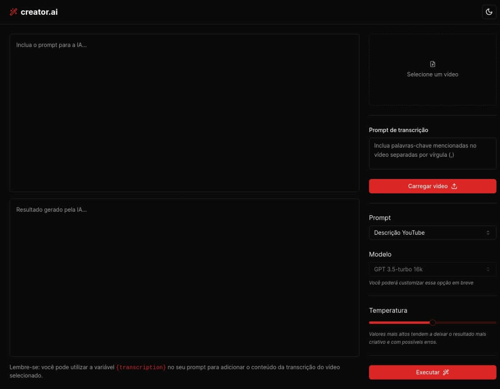
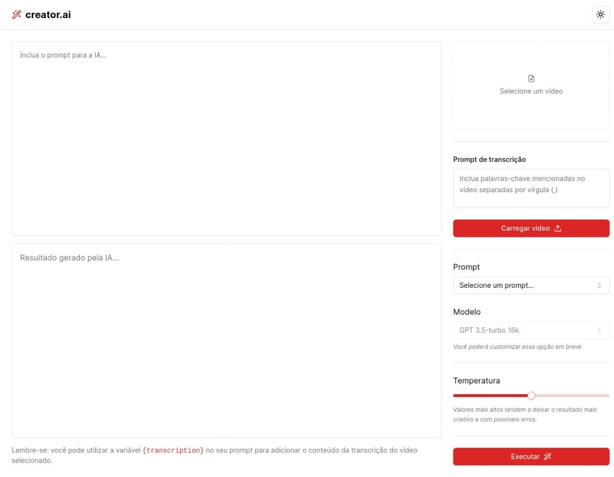

# creator.ai

Aplicação que possibilita realizar upload de videos e por meio de IA, criar automaticamente títulos chamativos e descrições com um boa indexação.





## Índice

- [Ferramentas](#ferramentas)
- [Instalação](#instalação)
- [Funcionalidade](#funcionalidades)
- [Licença](#licença)

## Ferramentas

- **React**
- **TypeScript**
- **Tailwind CSS**
- **Vite**
- **Radix UI**
- **Shadcn/ui**
- **ffmpeg.wasm**
- **Axios**

## Instalação

Siga as etapas abaixo para configurar e instalar o creator.ai em seu ambiente local:

1. Clone o repositório e acesse o diretório:

```bash
git clone git@github.com:brunohnsouza/creator-ai-react.git
cd creator-ai-react
```

2. Instale as dependências do projeto:

```bash
npm install
```

3. Inicie o servidor em modo de desenvolvimento:

```bash
npm run dev
```

Acesse http://localhost:5173 para visualizar a aplicação.

## Funcionalidades

- Upload de vídeos
- Conversão de vídeo para áudio utilizando o [ffmpeg.wasm](https://ffmpegwasm.netlify.app/)
- Transcrição de áudio utilizando o [Whisper (ASR - Automatic Speech Recognition)](https://openai.com/index/whisper/) da OpenAI
- Geração de resumo da transcrição utilizando o modelo GPT-3 da OpenAI
- Geração de títulos chamativos utilizando o modelo GPT-3 da OpenAI
- Cópia dos resultados gerados pela IA para a área de transferência

## Licença

[MIT](https://choosealicense.com/licenses/mit/)
